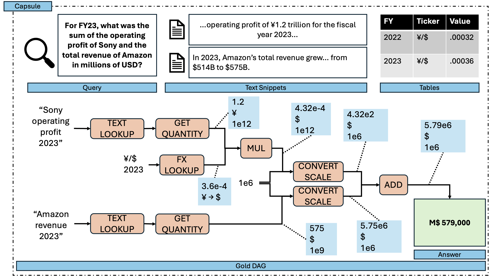

# TRACE: Structured Action-Trace Reasoning Benchmarking

This repository accompanies the TRACE paper manuscript introducing:

- `TRACE`: a framework for generating and evaluating agentic LLM reasoning with executable, structured action traces (DAGs).
- `TRACE-UFR`: the first released dataset built with TRACE for **unit-aware financial reasoning**.

The core idea is to evaluate reasoning through machine-checkable traces (not free-form chain-of-thought), so final answers, intermediate operations, and trace structure can all be audited.

## Example Capsule



*Figure: Example capsule from TRACE-UFR.*

## TRACE vs TRACE-UFR

| Component | What it is | Where it lives |
| --- | --- | --- |
| `TRACE` | The benchmark-agnostic framework core (compiler, executor, sampler, providers, reporting, CLI). | `src/TRACE/` |
| `TRACE-UFR` | A benchmark package built on TRACE for unit-aware financial reasoning. | `benchmarks/trace_ufr/` |
| Legacy baseline | Preserved pre-refactor implementation for in-repo parity checks. | `legacy/TRACE/` |
| Generated artifacts | Corpora, runs, caches, and parity outputs for both legacy and refactor flows. | `artifacts/` |

## What Is Included

- Generation pipeline:
  - `TRACE.cli generate`
- Execution/evaluation pipeline:
  - `TRACE.cli run`
  - `TRACE.cli run_sweep`
- Comparison / maintenance:
  - `TRACE.cli compare`
  - `TRACE.cli benchmark_tools`
- Make targets for reproducible runs:
  - `make smoke3_offline`
  - `make smoke3_gpt`
  - `make generate_TRACE-UFR`
  - `make run_TRACE-UFR_all_models`
  - `make legacy_smoke3_offline`
  - `make compare_smoke3_offline`

## Environment Setup

Install with the package metadata so `src/TRACE` is importable in a standard way:

```bash
python -m venv .venv
source .venv/bin/activate
python -m pip install --upgrade pip
python -m pip install -e .
```

If you prefer a non-editable dependency bootstrap first, this still works:

```bash
python -m pip install -r requirements.txt
python -m pip install -e .
```

Set API keys only if you run model-based modes:

```bash
export OPENAI_API_KEY=...
export ANTHROPIC_API_KEY=...
export GOOGLE_API_KEY=...
```

`make` targets still set `PYTHONPATH=src` automatically for compatibility.
After the editable install above, local imports work without manually exporting `PYTHONPATH`.
If you run modules manually without installing the package, set it yourself:

```bash
export PYTHONPATH=$PWD/src
```

## Running Tests

From the repo root after `python -m pip install -e .`:

```bash
python -m unittest discover -s tests -v
```

## Quick Start

### 1) Offline sanity check (no API calls)

```bash
make smoke3_offline
```

This runs a tiny 3-question oracle-mode corpus and writes results to:

- `artifacts/refactor/runs/run_smoke3_offline/`

The preserved baseline implementation can be run with:

```bash
make legacy_smoke3_offline
```

To compare legacy vs refactor on the smoke benchmark:

```bash
make compare_smoke3_offline
```

### 2) Generate TRACE-UFR corpus

```bash
make generate_TRACE-UFR
```

Equivalent public CLI:

```bash
python -m TRACE.cli generate --benchmark trace_ufr --out artifacts/refactor/corpora/TRACE-UFR
```

Default generation settings in `makefile`:

- distractor levels: `d = 0, 1, 3, 5, 10`
- `500` questions per distractor level
- total capsules: `2500`

### 3) Run TRACE-UFR across providers/models

```bash
make run_TRACE-UFR_all_models
```

Equivalent public CLI pattern:

```bash
python -m TRACE.cli run_sweep --benchmark trace_ufr --corpus-dir <corpus_dir> --out-dir <run_dir> --modes full --provider openai --models gpt-5.2
```

Outputs are written to:

- `artifacts/refactor/runs/run_TRACE-UFR_openai/`
- `artifacts/refactor/runs/run_TRACE-UFR_anthropic/`
- `artifacts/refactor/runs/run_TRACE-UFR_gemini/`

Each run also writes an aggregated file:

- `results_all.jsonl`

## Customizing Runs

You can override make variables inline:

```bash
make generate_TRACE-UFR TRACE_UFR_N_TOTAL=100 TRACE_UFR_D_ALL="0 3"
make run_TRACE-UFR_all_models TRACE_UFR_MODES="retrieval full" TRACE_UFR_MAX_JOBS=4
```

Provider model lists are configurable via:

- `OPENAI_MODELS`
- `ANTHROPIC_MODELS`
- `GEMINI_MODELS`

## Benchmark Tools

Benchmark-owned maintenance tools can be discovered and run via:

```bash
python -m TRACE.cli benchmark_tools list --benchmark trace_ufr
python -m TRACE.cli benchmark_tools run --benchmark trace_ufr prepare_extracts
```

## Dataset Notes (TRACE-UFR)

From the paper’s reported TRACE-UFR construction:

- 30 query templates
- 500 generated question instances
- 42 source text snippets
- 443 total factoids (277 used in generated questions)
- 57 numerical tables
- 3 distractor snippets per capsule in reported benchmark evaluation setup

The benchmark is designed to separate:

- evidence extraction quality (text lookup/fact extraction),
- reasoning graph quality (operation-level structure),
- final answer correctness.

## Repository Layout

```text
src/TRACE/                 # framework core, benchmark-aware CLI, providers, reporting
benchmarks/
  trace_ufr/
    extracts/              # extracted fact records for TRACE-UFR
    snippets/              # source snippets for TRACE-UFR
    tables/                # benchmark-owned numeric tables (fx, cpi, etc.)
    schemas/               # benchmark-owned schemas and enums
    templates/             # Python template/spec modules
legacy/
  TRACE/                   # preserved pre-refactor implementation
artifacts/
  legacy/                  # legacy corpora/runs used for parity
  refactor/                # refactored corpora/runs
figures/                   # figures used in this README/paper assets
makefile                   # reproducible experiment entry points
```
