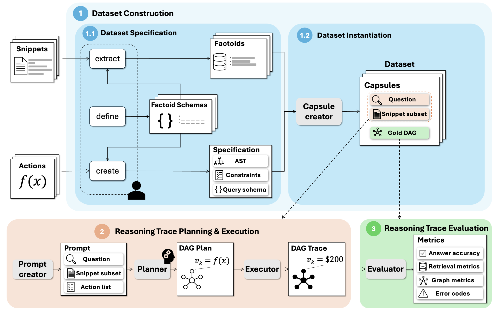

# TRACE: Structured Action-Trace Reasoning Benchmarking

TRACE is a framework for building and evaluating reasoning benchmarks where the model must produce an executable, structured trace rather than only a final answer or free-form chain-of-thought. A TRACE example is packaged as a **capsule**: a question, a subset of source snippets, and a gold directed acyclic graph (DAG) that describes the operations needed to answer the question.

The submitted NeurIPS paper uses this setup to separate three things that are usually entangled in reasoning benchmarks:

- whether the model retrieves or extracts the right evidence from the provided snippets,
- whether it plans the right operation graph,
- whether the executed trace yields the correct final answer.

TRACE is benchmark-agnostic. This repository currently includes the framework core plus two benchmark packages:

- `TRACE-UFR`: unit-aware financial reasoning over company snippets, numeric quantities, FX tables, CPI tables, and arithmetic/comparison templates.
- `TRACE-DIR`: document/information-retrieval style relation reasoning over medical snippets.

## Framework Overview



At a high level, TRACE has three stages:

1. **Dataset construction**: benchmark authors define fact schemas, actions, constraints, and query templates; TRACE samples facts from snippets and compiles template specifications into gold DAGs.
2. **Reasoning trace planning and execution**: a planner receives a question, snippet subset, and allowed action list, then returns a DAG plan. TRACE executes that DAG using registered action semantics.
3. **Reasoning trace evaluation**: TRACE reports answer accuracy, retrieval/fact-grounding metrics, graph metrics, and structured execution error codes.

## Example Capsule


A capsule is the unit of evaluation. It contains:

- `qid`: stable question identifier.
- `question`: natural-language query shown to the model.
- `context.snippets`: source snippets available to the planner.
- `gold.dag`: executable reference DAG.
- `gold.answer`: expected answer after executing the gold DAG.
- `gold.fact_map`: fact provenance used for grounding metrics.
- `meta`: benchmark, template, distractor, seed, and compilation metadata.

The core design point is that the model output is a machine-checkable DAG. The executor can validate each node, resolve references between nodes, run benchmark-specific actions, and attribute failures to extraction, planning, type, table lookup, arithmetic, or graph-structure issues.

## Quick Start

### 1. Install

TRACE requires Python `>=3.12`.

```bash
python -m venv .venv
source .venv/bin/activate
python -m pip install --upgrade pip
python -m pip install -e .
```

If you prefer installing pinned runtime dependencies first:

```bash
python -m pip install -r requirements.txt
python -m pip install -e .
```

The editable install makes `src/TRACE` importable. If you run modules without installing the package, set:

```bash
export PYTHONPATH=$PWD/src
```

### 2. Set Provider Keys

No keys are needed for oracle/offline runs. Set keys only for full model-planning runs:

```bash
export OPENAI_API_KEY=...
export ANTHROPIC_API_KEY=...
export GOOGLE_API_KEY=...
```

Supported full-mode providers are `openai`, `anthropic`, and `gemini`.

### 3. Run a No-API Smoke Test

```bash
make smoke3_offline
```

This generates a tiny `trace_ufr` corpus and executes it in `oracle` mode, where the gold DAG is executed directly. Outputs are written to:

```text
artifacts/refactor/corpora/smoke3/
artifacts/refactor/runs/run_smoke3_offline/
```

The aggregated run file is:

```text
artifacts/refactor/runs/run_smoke3_offline/results_all.jsonl
```

### 4. Generate a Dataset

Generate the default TRACE-UFR corpus:

```bash
make trace-ufr
```

Equivalent CLI:

```bash
python -m TRACE.cli generate \
  --benchmark trace_ufr \
  --out artifacts/refactor/corpora/TRACE-UFR \
  --distractors 0 1 3 5 10 \
  --n-total 600 \
  --seed 0 \
  --balance-templates \
  --max-compile-attempts 100 \
  --force
```

This writes:

```text
artifacts/refactor/corpora/TRACE-UFR/
  d=0/
  d=1/
  d=3/
  d=5/
  d=10/
  capsules.jsonl
  meta.json
  benchmark_profile.json
  benchmark_profile.md
```

Important generation options:

| Option | Meaning |
| --- | --- |
| `--benchmark` | Benchmark package to load, e.g. `trace_ufr`, `trace_dir`, or an import/path reference understood by `TRACE.core.benchmarks.loader`. |
| `--out` | Output corpus directory. |
| `--distractors` | One or more distractor-snippet counts. A separate `d=<n>/` directory is generated for each value. |
| `--n-total` | Number of capsules per distractor setting. |
| `--seed` | Base random seed. Per-distractor seeds are derived deterministically. |
| `--balance-templates` | Allocate examples as evenly as possible across registered templates. Overrides family/variant weighting. |
| `--p-family` | Family proportions such as `L0=0.4,A0=0.4,B0=0.2`. |
| `--w` | Per-family variant weights such as `L0=1,1,1;A0=1,0,0,0`. |
| `--max-compile-attempts` | Maximum attempts to sample bindings and compile a valid capsule. |
| `--force` | Allow generation into a non-empty output directory. |

### 5. Run Inference and Evaluation

Run full model-planning evaluation for one provider/model:

```bash
python -m TRACE.cli run_sweep \
  --benchmark trace_ufr \
  --corpus-dir artifacts/refactor/corpora/TRACE-UFR \
  --out-dir artifacts/refactor/runs/run_TRACE-UFR_openai \
  --modes full \
  --provider openai \
  --models gpt-5.2 \
  --max-jobs 1 \
  --resume
```

Run the configured provider/model matrix:

```bash
make run_TRACE-UFR_all_models
```

Useful make overrides:

```bash
make generate_TRACE-UFR TRACE_UFR_N_TOTAL=100 TRACE_UFR_D_ALL="0 3"
make run_TRACE-UFR_all_models TRACE_UFR_MODES="full" TRACE_UFR_MAX_JOBS=4
```

Provider model lists are controlled by:

```text
OPENAI_MODELS
ANTHROPIC_MODELS
GEMINI_MODELS
```

Important run options:

| Option | Meaning |
| --- | --- |
| `--benchmark` | Benchmark package used to load snippets, extracts, actions, schemas, and validation hooks. |
| `--corpus-dir` | Corpus directory produced by `TRACE.cli generate`. |
| `--out-dir` | Run output directory. |
| `--mode` / `--modes` | `oracle` executes gold DAGs; `full` asks a model provider to plan DAGs. |
| `--provider` / `--providers` | Provider(s) for `full` mode: `openai`, `anthropic`, `gemini`. |
| `--model` / `--models` | Model name(s). Required for `full` mode. |
| `--max-jobs` | Number of parallel leaf subprocesses. Use `1` for easiest debugging. |
| `--resume` | Skip completed qids in leaf `results.jsonl` files. |
| `--dump-trace-on-pass` | Persist traces for successful cases as well as failures. |
| `--verbose` | Print more detail during execution. |

Each sweep writes leaf run directories plus:

```text
results_all.jsonl
summary.json
summary.md
meta.json
```

### 6. Run the Main Resumable Pipeline

For the default single-model TRACE-UFR run with intermediates retained and compact final artifacts copied into `outputs/final-results/`:

```bash
make main_run
```

Equivalent direct command:

```bash
python scripts/main_run.py
```

Defaults:

- corpus: `outputs/intermediate/<run-id>/corpus`
- run artifacts and traces: `outputs/intermediate/<run-id>/runs/<provider>`
- final result bundle: `outputs/final-results/<run-id>`
- examples: `600`, balanced evenly across templates
- distractor setting: `d=3`
- provider/model: `openai` / `gpt-5.2`

The script resumes at step boundaries: it reuses a complete generated corpus, `run_sweep --resume` skips completed qids, completed leaf jobs are skipped, and final artifacts are recopied from completed intermediates.

## Repository Layout

Only the main user-facing directories are listed here.

| Path | Purpose |
| --- | --- |
| `src/TRACE/` | Framework core: CLI wrappers, benchmark loading, action registry, compiler, executor, providers, reporting, shared utilities. |
| `benchmarks/trace_ufr/` | TRACE-UFR benchmark package: snippets, extracts, schemas, tables, templates, benchmark hooks, and financial action overrides. |
| `benchmarks/trace_dir/` | TRACE-DIR benchmark package: medical snippets/extracts, relation templates, benchmark hooks, and relation actions. |
| `scripts/` | Experiment and paper-result utilities, including resumable runs, collation, analysis, and metadata generation. |
| `tests/` | Unit and contract tests for actions, benchmark loading, generation, execution, reporting, and CLI surface. |
| `figures/` | README and paper-facing figures. |
| `outputs/` | Main experiment intermediates and final result bundles. |
| `artifacts/` | Local generated corpora/runs used by make targets and parity checks. |
| `docs/` | Notes intended to grow into full documentation. |

Legacy and cache directories are intentionally omitted from the main tour.

## Core Components

### Benchmark Definition

Each benchmark is loaded through `TRACE.core.benchmarks.loader.load_benchmark`. A benchmark package exposes a `benchmark.py` module with:

- `BENCHMARK_ID`
- `SNIPPETS_DIR`, `EXTRACTS_DIR`, `SCHEMAS_DIR`, optional `TABLES_DIR`
- `TEMPLATES_MODULE`
- `ALLOWED_ACTIONS`
- `REGISTER_ACTIONS`
- optional hooks for extract loading, slot derivation, sampler constraints, planner prompt guidance, DAG validation, and maintenance tools

See:

- `benchmarks/trace_ufr/benchmark.py`
- `benchmarks/trace_dir/benchmark.py`
- `src/TRACE/core/benchmarks/types.py`

### Templates and Dataset Generation

Templates define the query families and gold reasoning structure that TRACE compiles into capsules. In TRACE-UFR, templates are grouped by family:

- `L0`: direct lookup questions
- `A0`: arithmetic questions
- `B0`: boolean/comparison questions

The registry lives at:

```text
benchmarks/trace_ufr/templates/registry.py
```

Generation samples extract records, checks template constraints, lowers the template to a gold DAG, hydrates the snippet context, adds distractors, and writes capsule JSON.

### Actions and Execution

Actions are typed operations available to DAG nodes. The framework provides common actions:

```text
MODEL_FACT
CONVERT_SCALE
CONST
ADD
MUL
DIV
GT
LT
EQ
AND
OR
```

TRACE-UFR allows:

```text
MODEL_FACT
CONVERT_SCALE
CONST
ADD
MUL
DIV
GT
LT
EQ
FX_LOOKUP
CPI_LOOKUP
```

TRACE-UFR registers `FX_LOOKUP` and `CPI_LOOKUP`, and overrides `MUL`/`DIV` to support financial quantity semantics.

Action definitions specify:

- name,
- argument schema,
- output schema,
- prompt documentation,
- executor function.

See:

- `src/TRACE/core/actions/types.py`
- `src/TRACE/core/actions/builtin.py`
- `benchmarks/trace_ufr/actions.py`
- `benchmarks/trace_dir/actions.py`

### Planning Providers

Provider modules convert a capsule plus benchmark action documentation into a planner prompt, call the selected model API, parse the returned DAG, and validate it before execution.

Provider code lives in:

```text
src/TRACE/providers/
  openai/
  anthropic/
  gemini/
  shared/
```

### Reporting

Reporting writes per-capsule results and aggregate summaries. Metrics include:

- answer correctness,
- execution success/failure,
- structured error code,
- predicted/gold DAG information,
- fact grounding,
- graph metrics,
- provider/model metadata,
- distractor level,
- template/family metadata.

See:

```text
src/TRACE/reporting/
```

## Extending TRACE

### Add a New Benchmark

Create a package under `benchmarks/<your_benchmark>/` with:

```text
benchmark.py
snippets/
extracts/
schemas/
templates/
actions.py        # optional, if built-ins are not enough
tables/           # optional, for benchmark-specific lookup tables
tools/            # optional maintenance tools
```

Then implement `benchmark.py` using the `BenchmarkDef` fields described above. The loader can import benchmarks by short name if they live under `benchmarks/`, or by module/path reference for local development.

### Add a New Action

1. Implement an executor with signature:

   ```python
   def _exec_my_action(ctx: ActionExecContext, node_id: str, args: dict[str, Any]) -> Any:
       ...
   ```

2. Register an `ActionDef` with argument and output specs.
3. Add the action name to the benchmark’s `ALLOWED_ACTIONS`.
4. Update prompt guidance if the planner needs benchmark-specific rules.
5. Add tests covering argument validation, output validation, and executor behavior.

For benchmark-specific behavior, register the action in `benchmarks/<benchmark>/actions.py` and call it from `REGISTER_ACTIONS`. For shared behavior, add it to `src/TRACE/core/actions/builtin.py`.

### Add a New Template

1. Add a `Spec` in the benchmark’s `templates/` package.
2. Define its slots, constraints, natural-language query shape, and gold operation structure.
3. Register it in `templates/registry.py`.
4. Run a small generation job:

   ```bash
   python -m TRACE.cli generate \
     --benchmark trace_ufr \
     --out /tmp/trace-template-check \
     --distractors 0 \
     --n-total 10 \
     --balance-templates \
     --force
   ```

5. Add or update tests for compilation, sampling constraints, and expected answer behavior.

### Add Source Data

For snippet-backed benchmarks, add:

- snippet JSON files under `snippets/`,
- extracted fact/relation records under `extracts/`,
- allowed labels or schemas under `schemas/`,
- optional lookup tables under `tables/`.

If your benchmark needs derived slots or custom existence checks for sampling, implement `DERIVE_SLOTS`, `BUILD_EXISTS_KEY`, `SAMPLER_CONSTRAINT_VARS`, and `SAMPLER_CONSTRAINT_OK` in `benchmark.py`.

## Benchmark Maintenance Tools

Benchmark-owned tools can be discovered and run through:

```bash
python -m TRACE.cli benchmark_tools list --benchmark trace_ufr
python -m TRACE.cli benchmark_tools run --benchmark trace_ufr prepare_extracts
```

TRACE-UFR currently exposes:

```text
prepare_extracts
generate_rates
list_currencies
```

TRACE-DIR exposes its own relation-extract preparation tool.

## Tests

Run the test suite with:

```bash
python -m unittest discover -s tests -v
```

or:

```bash
make test
```

Focused tests that are useful while extending the framework:

```bash
python -m unittest tests.test_action_contracts -v
python -m unittest tests.test_benchmark_contracts -v
python -m unittest tests.test_generation_profile -v
python -m unittest tests.test_runtime_and_validation -v
python -m unittest tests.test_trace_dir_benchmark -v
```

## Documentation

The README should stay as the fast path for installing, generating a corpus, running inference, and understanding the repo. More detailed user/developer documentation should live under `docs/` and can be published with [Read the Docs](https://about.readthedocs.com/).

A good Read the Docs structure for this project would be:

```text
docs/
  index.md
  quickstart.md
  framework.md
  capsules.md
  benchmarks.md
  actions.md
  templates.md
  generation.md
  inference.md
  reporting.md
  extending.md
  api.md
```

That split keeps this README usable while still giving space for exhaustive component descriptions, extension examples, command references, and paper-facing methodology notes.

## Dataset Notes

From the paper’s reported TRACE-UFR construction:

- 30 query templates
- 500 generated question instances
- 42 source text snippets
- 443 total factoids, with 277 used in generated questions
- 57 numerical tables
- 3 distractor snippets per capsule in the reported benchmark evaluation setup

The current make targets are configured for larger local sweeps by default:

- distractor levels: `0, 1, 3, 5, 10`
- `600` capsules per distractor level
- template-balanced allocation
- total default generated capsules: `3000`

## Notes for Paper Reproduction

Use `oracle` mode to validate generated gold DAGs and executor semantics without model calls. Use `full` mode for model-planned DAG evaluation. Keep `--resume` enabled for long provider sweeps so completed qids are skipped if a run is interrupted.

For compact final artifacts:

```bash
make main_run
```

For the two-benchmark, multi-provider experiment harness:

```bash
make experiment_run
```
